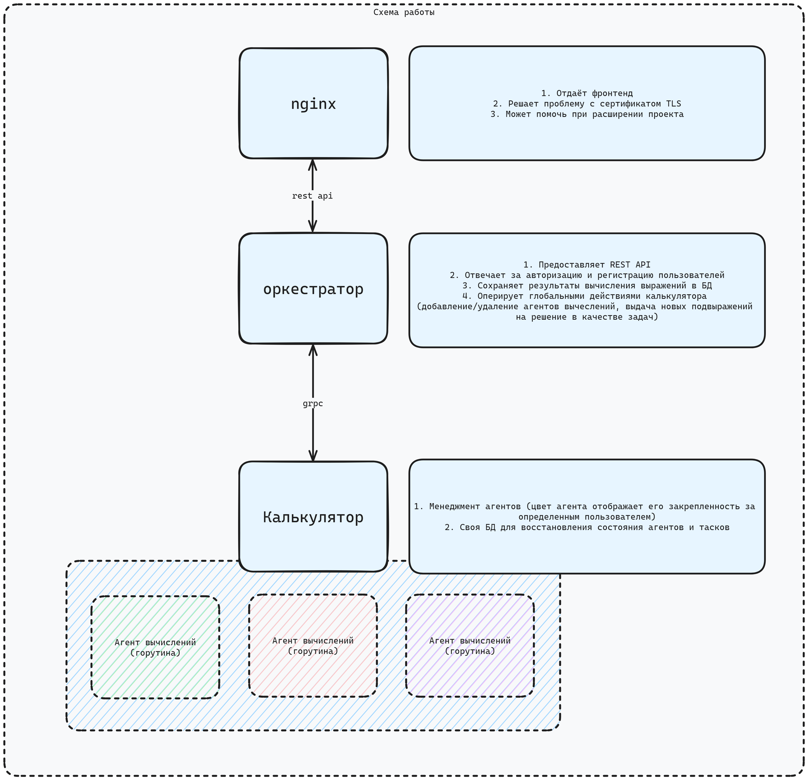
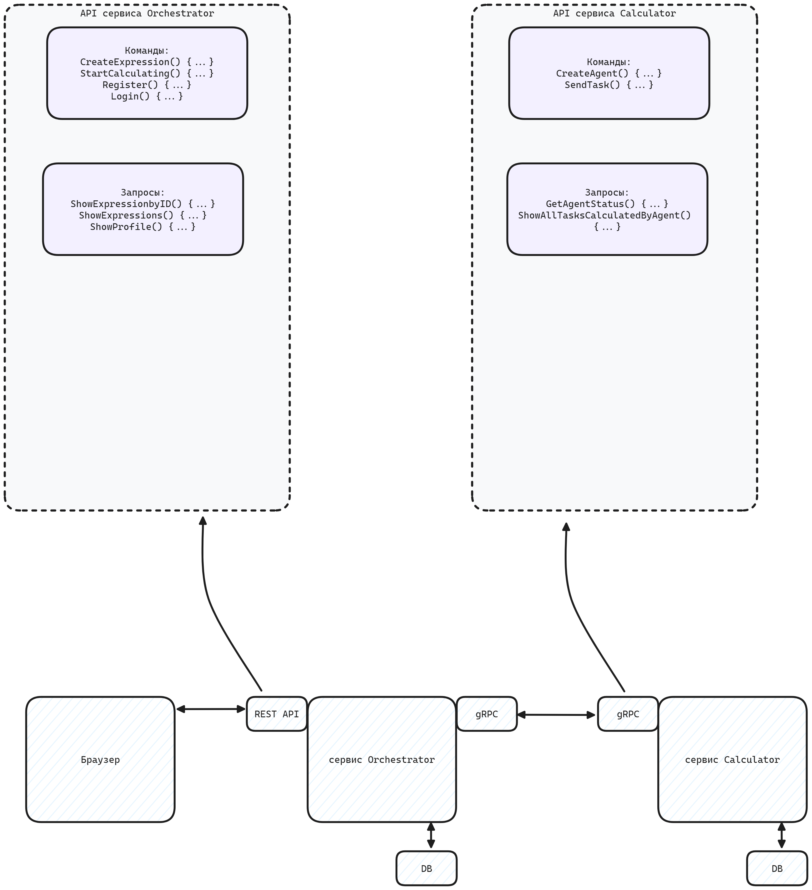
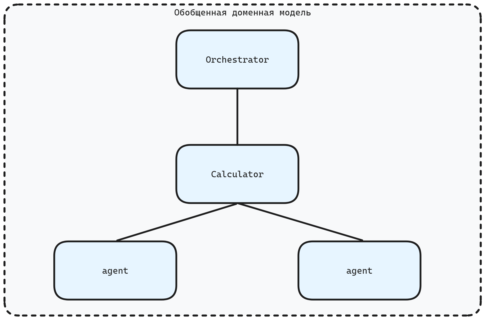
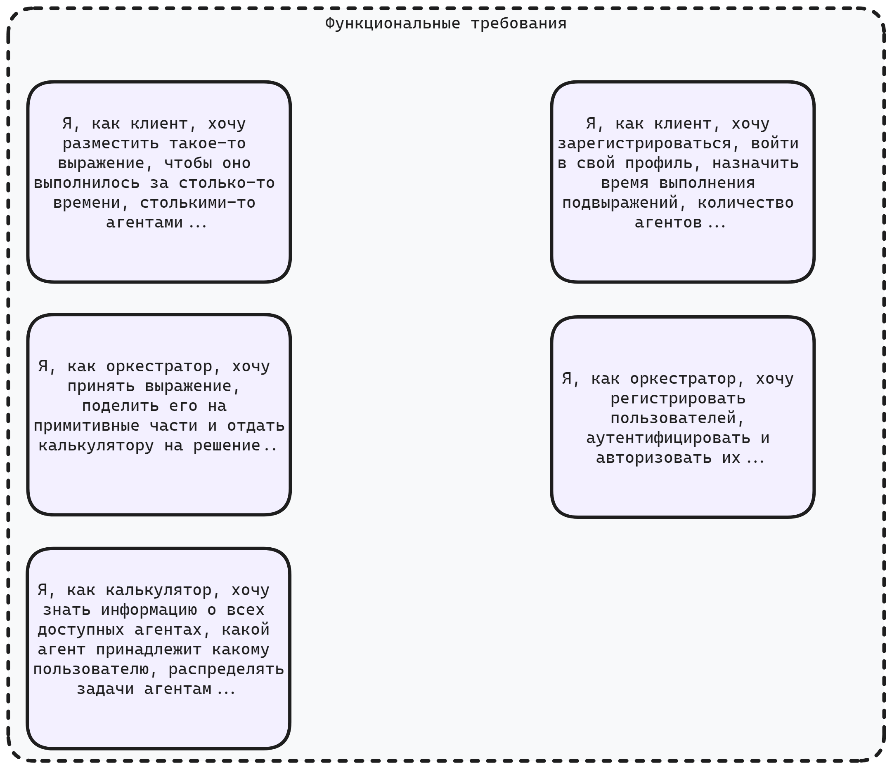

# Финальная задача "Распределенный вычислитель арифметических выражений" Спринт 2. Конкурентное программирование

## Описание:

> Пользователь хочет считать арифметические выражения. Он вводит строку 2 + 2 * 2 и хочет получить в ответ 6. Но наши
> операции сложения и умножения (также деления и вычитания) выполняются "очень-очень" долго. Поэтому вариант, при
> котором
> пользователь делает http-запрос и получает в качетсве ответа результат, невозможна. Более того: вычисление каждой
> такой
> операции в нашей "альтернативной реальности" занимает "гигантские" вычислительные мощности. Соответственно, каждое
> действие мы должны уметь выполнять отдельно и масштабировать эту систему можем добавлением вычислительных мощностей в
> нашу систему в виде новых "машин". Поэтому пользователь, присылая выражение, получает в ответ идентификатор выражения
> и
> может с какой-то периодичностью уточнять у сервера "не посчиталость ли выражение"? Если выражение наконец будет
> вычислено - то он получит результат. Помните, что некоторые части арфиметического выражения можно вычислять
> параллельно.

## Реализация

### Автор

Богданов Данила

#### Связаться со мной

Telegram: `@Dbugdanov`

E-mail: `official.dabogdanov@gmail.com`

### Установка

`git clone https://github.com/Akishy/yacalculator.git`  
`cd yacalculator`  
`cd orchestrator`  
`docker build -t orchestrator:latest . `  
`docker run -d --rm -p 127.0.0.1:8080:8080 orchestrator:latest`

### Использование

#### Регистрация

```bash
curl -X POST 'localhost:8080/register' -d 'username=test&password=test' -H 'Content-Type: application/x-www-form-urlencoded' -H 'accept: application/json' -vvvv
```

#### Логин

```bash
curl -X POST 'http://localhost:8080/login' -H 'Content-Type: application/x-www-form-urlencoded' -d 'username=test&password=test' -vvvv
```

> При авторизации вам выдается JWT токен, который необходимо передавать в заголовке запроса 'Authorization: Bearer
> {jwt}' в дальнейшем.

#### Добавить выражение

```bash
 curl -X POST 'http://localhost:8080/api/expressions' -H 'Authorization: Bearer {jwt}' -H 'Content-Type: application/json' -d '{"expression":"2+2","time_to_calc":3000,"start_to_calc":false}' -vvvv
```

> Где "start_to_calc" - булево значение, определяющее, надо ли начать высчитывать выражение сразу. Если false -
> выражение просто добавляется в профиль юзера. Если true - выражение добавляется в профиль юзера и начинает сразу
> вычисляться.

### Необходимые требования

#### Новые требования

| Критерий                                                                                                                 | Описание реализации                                                                                   |
|--------------------------------------------------------------------------------------------------------------------------|-------------------------------------------------------------------------------------------------------|
| Весь реализованный ранее функционал работает как раньше, только в контексте конкретного пользователя.                    | Да. Весь реализованный ранее функционал работает, но в контексте конкретного пользователя.            |
| У кого выражения хранились в памяти - переводим хранение в SQLite. (теперь наша система обязана переживать перезагрузку) | Раньше выражения хранились в памяти. Сейчас пользователи, выражения и подвыражения хранятся в SQLite. |
| У кого общение вычислителя и сервера вычислений было реализовано с помощью HTTP - переводим взаимодействие на GRPC       | В активной разработке.                                                                                |
| за покрытие проекта модульными тестами можно получить бонусные 10 баллов                                                 | Проект не покрыт модульными тестами.                                                                  |
| за покрытие проекта интеграционными тестами можно получить бонусные 10 баллов                                            | Проект не покрыт интеграционными тестами.                                                             |

#### Старые требования

| Критерий                                                                                                                                                                                                                                                                                                                                               | описание реализации                                                                                                                                                    |
|--------------------------------------------------------------------------------------------------------------------------------------------------------------------------------------------------------------------------------------------------------------------------------------------------------------------------------------------------------|------------------------------------------------------------------------------------------------------------------------------------------------------------------------|
| Существует Readme документ, в котором описано, как запустить систему и как ей пользоваться; Это может быть docker-compose, makefile, подробная инструкция - на ваш вкус. Если вы предоставляете только http-api, то - в Readme описаны примеры запросов с помощью curl-a или любым дргуми понятными образом - примеры полны и понятно как их запустить | Основной Readme документ - этот. система запускается с помощью Docker-контейнера. Предоставлена подробная инструкция. на текущий момент предоставлено только http-api. |
| Программа запускается и все примеры с вычислением арифметических выражений корректно работают                                                                                                                                                                                                                                                          | Примеры выше.                                                                                                                                                          |
| Программа запускается и выполняются произвольные примеры с вычислением арифметических выражений                                                                                                                                                                                                                                                        | Комментарий: работают только примеры с операторами + - / * с числами типа int и float. унарные операторы не поддерживаются. Скобки не поддерживаются.                  |
| Можно перезапустить любой компонент системы и система корректно обработает перезапуск (результаты сохранены, система продолжает работать)                                                                                                                                                                                                              | Да.                                                                                                                                                                    |
| Система предосталяет графический интерфейс для вычисления арифметических выражений                                                                                                                                                                                                                                                                     | В стадии активной разработки.                                                                                                                                          |
| Реализован мониторинг воркеров                                                                                                                                                                                                                                                                                                                         | Статус воркера и heartbeat.                                                                                                                                            |
| Реализован интерфейс для мориторинга воркеров                                                                                                                                                                                                                                                                                                          | В стадии активной разработки.                                                                                                                                          |
| Вам понятна кодовая база и структура проекта                                                                                                                                                                                                                                                                                                           | Старался поддерживать чистую архитектуру.                                                                                                                              |
| У системы есть документация со схемами, которая наглядно отвечает на вопрос: Как это все работает                                                                                                                                                                                                                                                      | Ниже в этом readme                                                                                                                                                     |
| Выражение должно иметь возможность выполняться разными агентами                                                                                                                                                                                                                                                                                        | +                                                                                                                                                                      |

### Схемы

**Схема работы**



**Схема работы расширенная**



**Обобщенная доменная модель**



**Функциональные требования**


